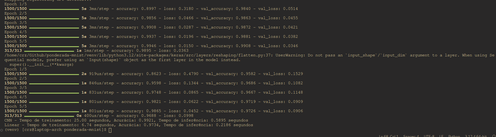

# PONDERADA-MNIST

## Instruções

Para rodar o projeto, siga os seguintes passos:

1. Clone o repositório:
    ```bash
    git clone https://github.com/pedrocruz2/ponderada-mnist
    cd PONDERADA-MNIST
    ```

2. Crie e ative um ambiente virtual:
    ```bash
    python3 -m venv venv
    source venv/bin/activate  # Para Linux/Mac
    .\venv\Scripts\activate  # Para Windows
    ```

3. Instale as dependências:
    ```bash
    pip install -r requirements.txt
    ```
4. Navegue para o diretório "src"
   ```bash
   cd src
   ```
4. Rode o backend:
    ```bash
    python backend.py
    ```

5. Acesse a aplicação:
    Abra um navegador e vá para `http://localhost:5000`

## Benchmark

### Comparação de Modelos

| **Modelo** | **Tempo de Treinamento** | **Acurácia de Treinamento** | **Tempo de Inferência** |
|------------|--------------------------|-----------------------------|-------------------------|
| CNN        | 25.0 segundos            | 99.21%                      | 0.5895 segundos         |
| Linear     | 6.74 segundos            | 97.34%                      | 0.2186 segundos         |

### Resultados Visuais

A imagem abaixo mostra as métricas de desempenho obtidas:



### Demonstração

Você pode assistir a uma demonstração do projeto no vídeo a seguir:


